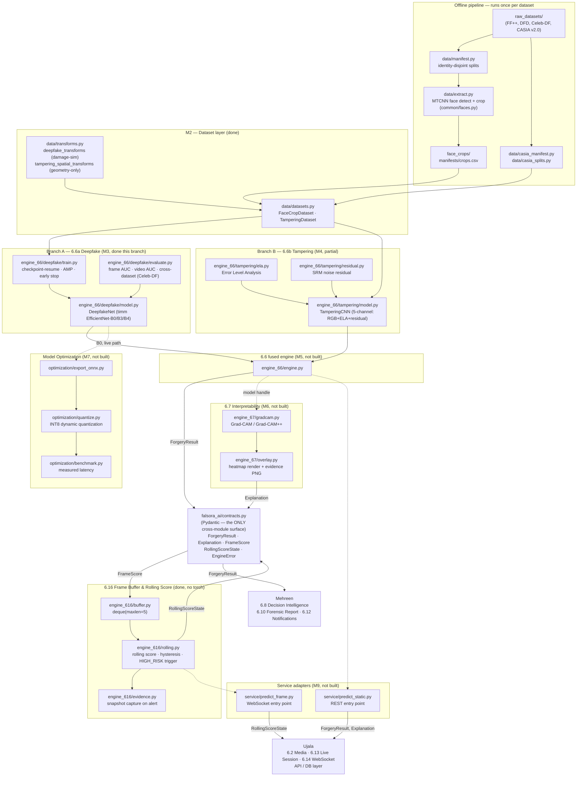
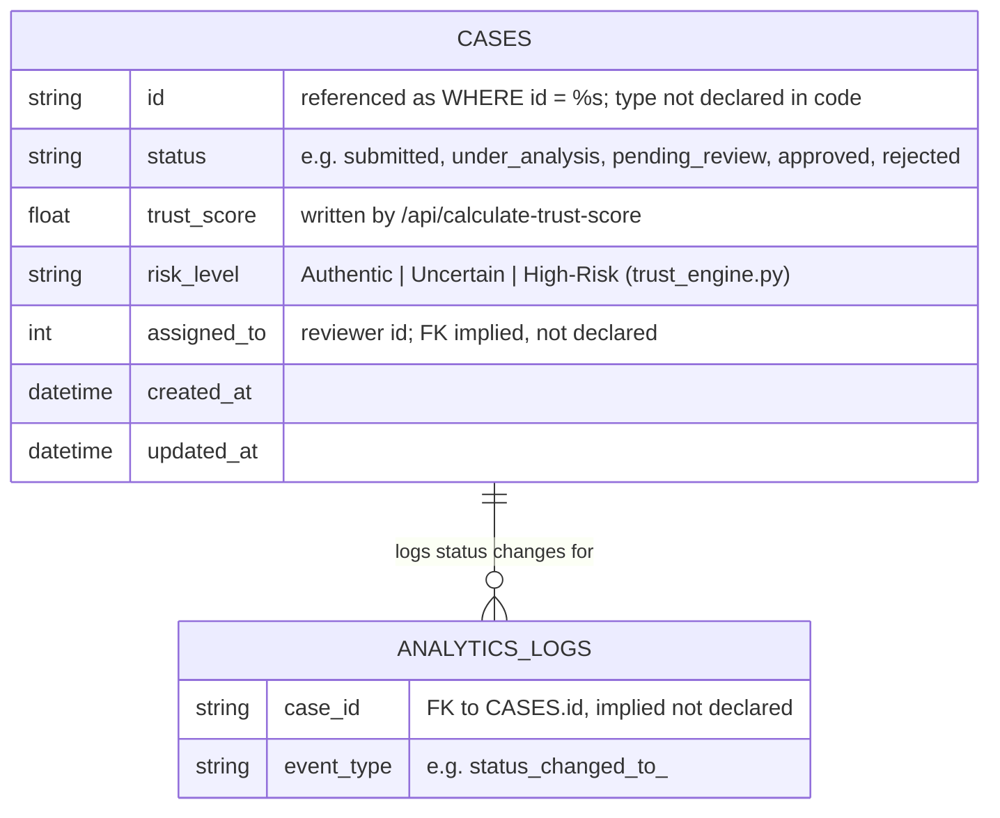
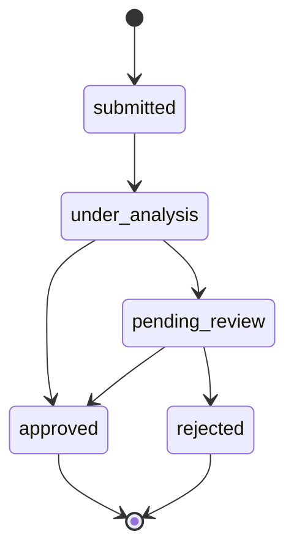

# Falsora — Architecture & Data Model

**Scope of this document.** Two diagrams follow, held to different standards of
certainty:

1. **AI & Forensic Engine architecture** (Maheen's modules 6.6 / 6.7 / 6.16 /
   Model Optimization) — every box and arrow below traces directly to a file,
   class, or config value in this repository (`ENGINEERING_PLAN.md`,
   `falsora_ai/contracts.py`, `falsora_ai/config.py`). This is accurate as of
   `git log -1` on the branch this file was written from.
2. **Entity-Relationship Diagram** — deliberately **partial**. This repository
   contains no formal schema (no migration files, no ORM models, no `.sql`
   files — verified by search). The only tables that exist anywhere in code
   are `cases` and `analytics_logs`, referenced via raw SQL in
   `backend/main.py` and `backend/modules/orchestration.py`, an early
   scaffold that is not part of Maheen's owned modules. The columns shown are
   exactly the columns those queries touch — nothing more. Tables for
   auth/RBAC (6.1), media processing (6.2), fingerprinting (6.4), source
   integrity (6.5), and notifications (6.12) are owned by Ujala and Mehreen
   and do not exist in this codebase, so they are **not diagrammed** rather
   than guessed at. Treat this ERD as a starting point to be completed once
   their schema is available, not as a finished system ERD.

---

## 1. AI & Forensic Engine — module architecture

Source: `ENGINEERING_PLAN.md` §3.2 (package layout), §4 (build sequence),
`falsora_ai/contracts.py` (integration surface). Build status as of this
branch: M0, M1, M2, M8 done; M3 (this branch) done; M4 partially done
(ELA/residual/`TamperingCNN` architecture only, no training loop yet); M5–M7,
M9, M10 not started.

**Key architectural rules encoded above (from `ENGINEERING_PLAN.md` §3.1 and
`contracts.py`'s module docstring — not stylistic choices):**

- `falsora_ai/contracts.py` is the **only** cross-module data surface. Ujala
  and Mehreen import from there and nowhere else inside `falsora_ai`.
- `engine_616` (M8) never imports torch — it is pure Python over a `deque`,
  independently usable by Ujala's WebSocket server without loading a model.
- `ForgeryResult` deliberately has **no** `risk_level` field — Low/Medium/High
  banding belongs to Mehreen's 6.8 Decision Intelligence Engine, not the AI
  engine.
- `probability_fake` (ML convention, higher = worse) and `authenticity`
  (scope convention, higher = better) are complements exposed on every
  relevant model; the conversion lives in exactly one place
  (`FrameScore`/`DeepfakeSignal`'s `authenticity` computed field).

---

## 2. Entity-Relationship Diagram — verified portion only

Source: raw SQL in `backend/main.py` and `backend/modules/orchestration.py`.
No primary-key or foreign-key constraints, data types, or additional columns
are declared anywhere in code — the ones below are the exact columns each
query reads or writes, nothing inferred beyond that.

**Explicitly not diagrammed** (no code exists in this repo to verify them):
users/accounts + roles (6.1 Auth/RBAC), media/upload records (6.2), file
fingerprints (6.4), EXIF/source-integrity findings (6.5), notifications
(6.12), live session records (6.13). These belong to Ujala's and Mehreen's
modules. Ask them for their schema (or migration files, if any exist) to
extend this ERD accurately — I won't fabricate table structures I can't
verify.

**`VALID_TRANSITIONS` state machine** for `CASES.status`, from
`backend/modules/orchestration.py` (this part *is* fully verifiable — it's
plain Python, not inferred from SQL):

